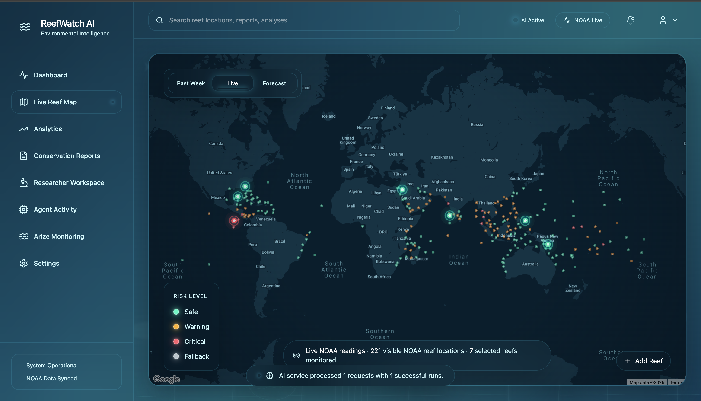
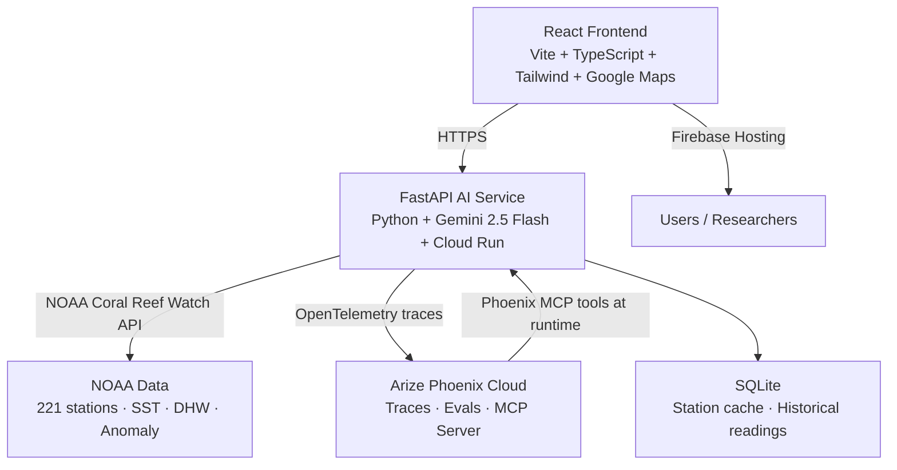

# 🌊 ReefWatch AI

### The ocean is dying. We built an AI that never stops watching.

[](https://opensource.org/licenses/MIT)
[](https://deepmind.google/technologies/gemini/)
[](https://phoenix.arize.com)
[](https://coralreefwatch.noaa.gov)
[](https://cloud.google.com/run)

**Live demo:** https://project-9b3e2672-8819-4fa5-afe.web.app

---

## The Crisis

Coral reefs cover less than 1% of the ocean floor. They support **25% of all marine life**. Over **1 billion people** depend on them for food, income, and coastal protection.

Since 1950, we have lost half of them.

The primary killer is thermal stress — when ocean temperatures rise even 1°C above seasonal norms for several weeks, corals expel the algae living in their tissues, turn ghostly white, and begin to starve. This is bleaching. If the heat persists, they die.

The 2016 bleaching event destroyed **67% of coral in the northern Great Barrier Reef in a single year**. The 2023 global bleaching event, the fourth mass bleaching in recorded history, affected reefs across every ocean simultaneously.

The cruelest part: **we usually find out too late.**

NOAA satellites monitor sea surface temperatures globally, 24 hours a day. The data exists. But translating thousands of data points into actionable intelligence — for hundreds of reef sites, every single day, requires more human hours than the entire global conservation community can provide.

**ReefWatch AI was built to close that gap.**



---

## What It Does

ReefWatch AI is a fully autonomous coral reef intelligence agent running 24/7 on Google Cloud. It monitors 221 live NOAA reef stations worldwide, reasons over thermal stress data using Gemini 2.5 Flash, fires real email alerts when bleaching thresholds are crossed, and crucially **evaluates and improves its own AI outputs over time** using Arize Phoenix observability.

It does not replace marine biologists. It gives them superpowers.

---

## Key Features

### 🗺️ Live Global Reef Map
Interactive Google Maps visualization of 221 NOAA monitoring stations worldwide. Color-coded by real-time bleaching risk. Click any station to see live sea surface temperature, SST anomaly, Degree Heating Weeks, and AI-generated risk assessment. Stations actively monitored by AI are highlighted in real time.

### 🤖 Gemini AI Risk Analysis
Every active reef is analyzed by Gemini 2.5 Flash using live NOAA data. The AI produces a structured assessment including risk score (0–100), confidence level, threat summary, recommended actions, and historical context — automatically, on every data refresh.

### 🔁 Self-Improvement Loop
The most important feature. A nightly evaluation pipeline uses **Gemini as an LLM as a Judge** to score recent reef assessments on accuracy, specificity, actionability, and hallucination avoidance. When quality drops below threshold, the system **automatically rewrites its own prompts**. No human intervention required. The agent gets better by itself.

Current scores: Quality 89% · Accuracy 91% · Hallucination Avoidance 94%

### 🔍 Phoenix MCP Runtime Introspection
The Gemini agent is configured with **Arize Phoenix MCP as a callable function tool**. At runtime, when the agent needs to reason about its own performance, it calls `query_phoenix_traces` and `query_phoenix_quality_metrics` directly — retrieving its own operational data mid-inference. Every MCP tool call is logged with timestamp, tool name, and retrieved data, visible in the Arize Monitoring dashboard. This is not just observability. This is **self-awareness**.

### 📋 Conservation Brief Generator
Select any monitored reef and generate a full scientific conservation brief in seconds — executive summary, conditions analysis, risk assessment, recommended actions, and urgency level for funding bodies. Downloadable as PDF.

### 💬 Researcher Workspace
A natural language AI agent that answers complex research questions using live NOAA data. Ask "Which reefs in Southeast Asia are approaching critical thresholds?" — the agent fetches live data, reasons over it in multiple steps, calls Phoenix MCP tools if performance data is needed, and responds with specific findings and confidence scores.

### 📡 Arize Monitoring Dashboard
Full AI observability powered by Phoenix. 3,392+ traces logged. LLM latency, token usage, cache hit rate, error rate, and MCP tool call timeline — all visible in real time. Every Gemini inference is inspectable.

### 🚨 Autonomous Alert System
Running 24/7 on Cloud Run. When a reef crosses a critical bleaching threshold, ReefWatch AI sends automated email alerts with pre-generated conservation briefs. Active alerts firing now: Southern Tonga 90% · Nauru 92% · Galapagos 98%.

---

## Architecture


---

| Layer | Technology | Purpose |
|-------|-----------|---------|
| Frontend | React + Vite + TypeScript | Interactive reef map, dashboards, researcher workspace |
| AI Service | FastAPI + Gemini 2.5 Flash | Risk analysis, conservation briefs, chat agent, self-evaluation |
| Observability | Arize Phoenix + OpenInference | Trace logging, LLM-as-a-Judge evals, MCP runtime introspection |
| Data | NOAA Coral Reef Watch | Live SST, DHW, bleaching alert levels for 221 stations |
| Infrastructure | Google Cloud Run + Firebase | 24/7 deployment, min-instances=1, cold start protection |
| Database | SQLite | Station cache, historical readings, event log |
## How The Agent Works

ReefWatch AI operates as a true multi-step autonomous agent:

**1. Continuous Data Ingestion**
Every night at 2am, the agent fetches fresh NOAA data for all 221 stations with a 200ms throttle between requests. Sea surface temperature, SST anomaly, and Degree Heating Weeks are cached locally.

**2. AI Risk Analysis**
For each actively monitored reef, Gemini 2.5 Flash receives structured NOAA data and produces a risk assessment with confidence score (0–100), threat classification, and recommended conservation actions.

**3. Full Observability**
Every Gemini call is automatically traced by OpenInference instrumentation and logged to Arize Phoenix with input, output, latency, and token usage metadata. 3,392+ traces logged.

**4. Phoenix MCP Runtime Introspection**
The agent is configured with the Phoenix MCP server as callable function tools. When the self-improvement loop runs — or when a researcher asks about system performance — the agent calls `query_phoenix_traces` and `query_phoenix_quality_metrics` at runtime, retrieving its own operational data to inform its reasoning. This closes the loop: the agent doesn't just produce data for observability. It reads that data back and uses it.

**5. Self-Evaluation & Prompt Rewriting**
The LLM-as-a-Judge pipeline queries Phoenix for recent traces, scores each assessment across four quality dimensions, and automatically rewrites the system prompt when quality drops below threshold. Prompt version history is maintained. Improvements are logged.

**6. Autonomous Alerting**
A Cloud Scheduler health ping keeps the service warm every 4 minutes. When bleaching thresholds are crossed, email alerts fire automatically with pre-generated conservation briefs attached.

---

## Judging Criteria Alignment (Arize Track)

| Criterion | How ReefWatch AI Addresses It |
|-----------|------------------------------|
| **Gemini Agent** | Autonomous reef monitoring agent, not a chatbot. Multi-step reasoning, autonomous alerting, 24/7 operation on Cloud Run |
| **Phoenix Observability** | 3,392+ traces, LLM latency tracked, token usage visible, input/output logged, cache hit rate monitored |
| **MCP Integration** | Phoenix MCP wired as callable Gemini function tools. Agent queries its own traces at runtime. Every call logged with retrieved data |
| **Self-Improvement Loop** | LLM-as-a-Judge evaluates output quality nightly, rewrites prompts automatically when scores drop. Scores visible on dashboard |
| **Real-World Impact** | Live NOAA data, real email alerts firing for critical reefs, conservation briefs downloadable as PDF |

---

## Tech Stack

**Frontend**
- React 18 + TypeScript
- Vite
- Tailwind CSS
- @vis.gl/react-google-maps
- Custom glassmorphism design system

**AI Service**
- FastAPI (Python)
- Gemini 2.5 Flash
- google-generativeai SDK
- openinference-instrumentation-google-genai
- arize-phoenix-otel

**Observability**
- Arize Phoenix Cloud
- OpenInference (OpenTelemetry-compatible)
- Phoenix MCP Server (`@arizeai/phoenix-mcp`)

**Infrastructure**
- Google Cloud Run (AI service, min-instances=1)
- Firebase Hosting (frontend)
- Cloud Scheduler (health pings + nightly refresh)
- SQLite (local station cache)

**Data**
- NOAA Coral Reef Watch CoralTemp API
- NOAA Virtual Station Network (221 stations)

---

## Getting Started

### Prerequisites
- Node.js 18+
- Python 3.9+
- Google Maps API key
- Gemini API key (Google AI Studio)
- Arize Phoenix Cloud account (free at phoenix.arize.com)

### 1. Clone the repository
```bash
git clone https://github.com/MahroshAtif2005/ReefWatch-AI.git
cd ReefWatch-AI
```

### 2. Install frontend dependencies
```bash
npm install
```

### 3. Set up Python AI service
```bash
cd ai-service
python3 -m venv .venv
source .venv/bin/activate
pip install -r requirements.txt
cp .env.example .env
```

### 4. Configure environment variables

Root `.env`:
VITE_GOOGLE_MAPS_KEY=your_google_maps_api_key

`ai-service/.env`:
GEMINI_API_KEY=your_gemini_api_key
PHOENIX_COLLECTOR_ENDPOINT=https://app.phoenix.arize.com/v1/traces
PHOENIX_API_KEY=your_phoenix_api_key

### 5. Start the AI service
```bash
cd ai-service
source .venv/bin/activate
uvicorn main:app --host 127.0.0.1 --port 8000 --reload
```

### 6. Start the frontend
```bash
npm run dev
```

### 7. Open the app
http://localhost:5173

---

## Environment Variables

| Variable | Service | Description |
|----------|---------|-------------|
| `VITE_GOOGLE_MAPS_KEY` | Frontend | Google Maps JavaScript API key |
| `GEMINI_API_KEY` | AI Service | Google AI Studio API key |
| `PHOENIX_COLLECTOR_ENDPOINT` | AI Service | Phoenix trace ingestion endpoint |
| `PHOENIX_API_KEY` | AI Service | Phoenix Cloud API key |

---

## Live Deployment

- **Frontend:** Firebase Hosting — https://project-9b3e2672-8819-4fa5-afe.web.app
- **AI Service:** Google Cloud Run — us-central1, min-instances=1
- **Observability:** Arize Phoenix Cloud — project reefwatch-ai

---

## License

MIT License — see [LICENSE](LICENSE) for details.

---

## Acknowledgments

- [NOAA Coral Reef Watch](https://coralreefwatch.noaa.gov) — for free, public global reef monitoring data
- [Google Gemini](https://deepmind.google/technologies/gemini/) — for AI reasoning capabilities  
- [Arize Phoenix](https://phoenix.arize.com) — for AI observability infrastructure
- Every marine biologist and conservation researcher working to protect what remains

---

*Coral reefs took thousands of years to build. ReefWatch AI exists to make sure we don't lose them in decades.*
